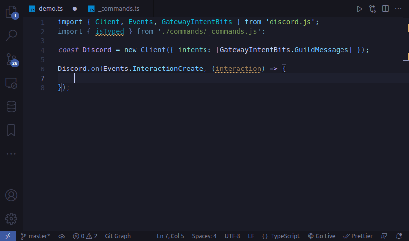

# discord.js typed commands

## About

Implements a type system that provides type-safety, intellisense and autocompletions for command names, subcommands, option types and option choices for the [discord.js library](https://github.com/discordjs/discord.js).



## Table of Contents

- [Installation](#installation)
- [Basic usage](#basic-usage)
  - [Narrowing the interaction type](#narrowing-the-interaction-type)
  - [Accessing interaction options](#accessing-interaction-options)
  - [Commands vs subcommands](#commands-vs-subcommands)
  - [Option types and values](#option-types-and-values)
  - [Use a specific command as function parameter](#use-a-specific-command-as-function-parameter)
  - [Use a specific subcommand as function parameter](#use-a-specific-subcommand-as-function-parameter)
  - [Defining command list as a type](#defining-command-list-as-a-type)
- [Details](#details)
- [FAQ](#faq)
- [Todo](#todo)
- [Changelog](#changelog)
- [License](#changelog)

## Installation

Install the package via npm:

```bash
npm install discordjs-typed-commands
```

## Basic usage

In your project, create a file where you define your commands and import `typed` and `ReadonlyCommandList` from the library. Declare your `commands` then pass that array to the `typed` function and export it for usage elsewhere in your project.


```ts
/* commands/_commands.ts */ 
import { typed } from 'discordjs-typed-commands';
import type { ReadonlyCommandList } from 'discordjs-typed-commands';

export const commands = [
    /* your command list goes here */
] as const satisfies ReadonlyCommandList;

export const isTyped = typed(commands);
```

> **Important**: you must use `as const satisfies ReadonlyCommandList` when you declare your commands.

Import `isTyped` anywhere you need it (usually where your Discord client is expected to receive interactions) and you're ready to go!

```ts
/* app.ts */
import { Client, Events } from 'discord.js';
import { isTyped } from './commands/_commands.js';

const discord = new Client({ intents: [ /* ... */] });

discord.on(Events.InteractionCreate, async interaction => {
    if (isTyped.command(interaction, 'play')) {
        if (isTyped.subcommand(interaction, 'coin-toss')) {
            const coin = interaction.options.get('coin').value;
            /* 'heads' | 'tails' */
        }
    }

    else if (isTyped.command(interaction, 'greet')) {
        const user = interaction.options.get('user').user;
        /* User object */
    }
});
```

Check out the [example directory](/example/) for a complete demo.

## Details

The examples demonstrated in this section will assume you have a command list (`commands`) with the following structure:

```
commands
├─ greet
|  └─ user (o)
├─ play
|  └─ coinflip (s)
│     └─ coin (o)
|        ├─ heads (c)
|        └─ tails (c)
│  ├─ rock-paper-scissors (s)
|  |  └─ hand (o)
|  |     ├─ rock (c)
|  |     ├─ paper (c)
|  |     └─ scissors (c)

s = subcommand | o = option | c = choice
```

For full code implementation of the above, check out [commands/_commands.ts](/example/commands/_commands.ts) in the example directory.

### Narrowing the interaction type

As seen in the example from the "Basic Usage" section, we invoke the `typed` function and supply a list of our `commands` as it's only paramater. The newly created `isTyped` function is the one that holds all the type information for our commands.

```ts
const isTyped = typed(commands);
```

When the Discord client receives an interaction, we use the `.command` method of this function to determine which one of our commands matches this interaction. It receives the `interaction` object as it's first parameter, and the name of the command as it's second.

```ts
import { isTyped } from './commands/_commands_.js';

discord.on(Events.InteractionCreate, async interaction => {
    if (isTyped.command(interaction, 'greet')) {
        /* This is a "greet" interaction */
    }
});
```
> **Note:** Under the hood, the [command](/src/lib.ts#L43) method is just a type guard function, which builds on top of [isChatInputCommand](https://discord.js.org/#/docs/discord.js/main/class/BaseInteraction?scrollTo=isChatInputCommand) from discord.js.

Similarly, there is way to check for subcommands, but more on that later.

### Accessing interaction options

In order to access the interaction options, narrow down the interaction type just as demonstrated in the previous section, then you can start accessing them via the `interaction.options.get` method.

```ts
discord.on(Events.InteractionCreate, async interaction => {
    if (isTyped.command(interaction, 'greet')) {
        /* User object */
        const user = interaction.options.get('user').user;
        /* or with destructuring */
        const { user } = interaction.options.get('user');
    }
});
```

**We access all interaction options via the `get` method only**, since this is what give us type-safety, intellisense and autocomplete. There is no need to use `getString`, `getBoolean`, `getUser` or other methods from discord.js.

For example:

- The `greet` command `user` option would be inferred as a `User` object.

- The `play` command `coin-toss` subcommand `coin` option could be narrowed down to a string literal union of `'heads' | 'tails'`.

```ts
/* greet command */
const user = interaction.options.get('user').user;
user.username; /* string */
user.tag; /* string */

/* coin-toss subcommand */
const coin = interaction.options.get('choice').value;
coin; /* 'heads' | 'tails' */
```

> **Note:** All of this works because our `commands` list from earlier is defined as an immutable array, which we then pass to the `typed` function and export as `isTyped`. This library puts all pieces of the puzzle together so TypeScript knows at compile time (when you're editing your code) what data to expect from each individual command.

### Commands vs subcommands

You will notice that if you narrow down the interaction to `play` and try to access it's options, Typescript you will give you an error:

```ts
discord.on(Events.InteractionCreate, async interaction => {
    if (isTyped.command(interaction, 'play')) {
        const coin = interaction.options.get('coin').value;
        /* Error: Argument of type  is not assignable to parameter of type never. */
    }
});
```

This is because our first command `greet` has no subcommands, so we are able to access it's options directly. But the `play` command has two subcommands, `coin-toss` and `rock-paper-scissors`, and so far we haven't done any checks to determine which type of subcommand our `interaction` holds.

Technically this piece of code probably won't crash your application, but it wouldn't make sense to try and access the `coin` option if our interaction subcommand is `rock-paper-scissors`. Likewise, it wouldn't make sense to access the `hand` option if the subcommand is `coin-toss`, in runtime it's always going to return `null` in both cases.

The solution is really simple, if your command has subcommands, narrow down the subcommand first:

```ts
discord.on(Events.InteractionCreate, async interaction => {
    if (isTyped.command(interaction, 'play')) {

        /* can NOT use interaction.options.get('...') yet */
        const coin = interaction.options.get('coin').value;
        /* Error: ...                         ^^^^        */

        if (isTyped.subcommand(interaction, 'coin-toss')) {
            /* can now use interaction.options.get('...') */
            const coin = interaction.options.get('coin').value;
        }

        else if (isTyped.subcommand(interaction, 'rock-paper-scissors')) {
            /* can now use interaction.options.get('...') */
            const hand = interaction.options.get('hand').value;
        }
    }
});
```

In summary:

- If the command has any subcommands, narrow down which subcommand the `interaction` has.
- If the command has no subcommands, you can use `interaction.options.get('...')` directly.

> **Note:** This is not something you have to actively think or worry about, since again, if you haven't narrowed down the subcommand, TypeScript will just give you an error or if there is no subcommand you wouldn't attempt narrowing.
>
> Additionally, the Discord API does not allow subcommands and options of basic type as siblings, so that makes things quite a bit easier. When you define the list of your `commands` as shown earlier, you will also get errors at compile time if you input data of the wrong type or structure.

### Option types and values

The way you declare your commands and their options determines what kind of types to expect, and the `required` and `choices` properties play a special role. This is best demonstrated with an example. Consider the following command:

```ts
/* commands/_commands.ts */ 
const commands = [
    {
        name: 'option-types',
        options: [
            { name: 'A', type: ApplicationCommandOptionType.String, required: true,
                choices: [
                    { name: 'foo', value: 'foo-value' },
                    { name: 'bar', value: 'bar-value' },
                ]
            },
            { name: 'B', type: ApplicationCommandOptionType.String, required: true },
            { name: 'C', type: ApplicationCommandOptionType.String, required: false,
                choices: [
                    { name: 'foo', value: 'foo-value' },
                    { name: 'bar', value: 'bar-value' },
                ]
            },
            { name: 'D', type: ApplicationCommandOptionType.String, required: false },
        ]
    }
] as const satisfies ReadonlyCommandList;
```

> **Note:** required is `false` by default (if omitted).

| option (name) | required? | choices? |
|:---:|:---:|:---:|
|  A  |  ✓  |  ✓  |
|  B  |  ✓  |  ✖  |
|  C  |  ✖  |  ✓  |
|  D  |  ✖  |  ✖  |

A command defined as such allows us to determine what kind of value each option has at compile time:

```ts
if (isTyped.command(interaction, 'option-types')) {
    /** 'foo-value' | 'bar-value' */
    const a = interaction.options.get('A').value;
    /** string */
    const b = interaction.options.get('B').value;
    /* 'foo-value' | 'bar-value' | undefined */
    const c = interaction.options.get('C')?.value;
    /* string | undefined */
    const d = interaction.options.get('D')?.value;
}
```

### Use a specific command as function parameter:

You can define a specific command as a type, then use that type as a function parameter. This is useful if you want to pass down your interaction from one function to another, and/or restrict what type of interaction the function accepts.

```ts
/* some parts skipped for brevity */
import { TypedCommand } from 'discordjs-typed-commands';

const commands = [ /* ... */ ] as const satisfies ReadonlyCommandList;
type GreetCommand = TypedCommand<typeof commands, 'greet'>;

async function handleGreet(interaction: GreetCommand) {
    /* This function will only accept the "greet" command */
}

discord.on(Events.InteractionCreate, async interaction => {
    if (isTyped.command(interaction, 'greet')) {
        await handleGreet(interaction);
    }
});
```

### Use a specific subcommand as function parameter:

Similarly, you can do this for subcommands.

```ts
/* some parts skipped for brevity */
import { TypedSubcommand } from 'discordjs-typed-commands';

const commands = [ /* ... */ ] as const satisfies ReadonlyCommandList;
type CoinTossSubcommand = TypedSubcommand<typeof commands, 'play', 'coin-toss'>;

async function handleCoinToss(interaction: CoinTossSubcommand) {
    /* This function will only accept the "coin-toss" subcommands */
}

discord.on(Events.InteractionCreate, async interaction => {
    if (isTyped.command(interaction, 'play')) {
        /* narrow down the subcommand first */
        if (isTyped.subcommand(interaction, 'coin-toss')) {
            await handleCoinToss(interaction); /* success! */
        }
    }
});
```

> **Important**: in order to get editor autocomplete when defining a subcommand type, supply the first parameter (`typeof commands`), then leave the last two as empty strings:

```ts
/* Define (write down) your type like this at first: */
type ExampleSubcommand1 = TypedSubcommand<typeof commands, '', ''>;
/* Then you will get autocomplete for the 2nd and then the last generic parameters */
type ExampleSubcommand1 = TypedSubcommand<typeof commands, 'play', ''>;
type ExampleSubcommand1 = TypedSubcommand<typeof commands, 'play', 'coin-toss'>;

/* If you start writing this, autocomplete won't work: */
type ExampleSubcommand1 = TypedSubcommand<typeof commands, ''
/*                                    no autocomplete here ^
```

### Defining command list as a type

You can create a single type that holds all your `commands` via the `TypedCommandList` helper type. This lets you organize and structure your code easier.

```ts
/* commands/_commands.ts */
import { TypedCommandList } from 'discordjs-typed-commands';

const commands = [ /* ... */ ] as const satisfies ReadonlyCommandList;
export type Command = TypedCommandList<typeof commands>;

/* greet.ts */
import { Command } from './commands/_commands.ts';

async function handleGreet(interaction: Command['greet']) {
    /* This function will only accept the "greet" command */
}

/* play.ts */
import { Command } from './commands/_commands.ts';

async function handlePlay(interaction: Command['play']) {
    /* This function will only accept the "play" command */
}
```

## FAQ

Q: **Does this package support CommonJS (require)**

A: Sorry, no, and there are no plans to. [Read more here](https://gist.github.com/sindresorhus/a39789f98801d908bbc7ff3ecc99d99c).

Q: **How can I contribute?**

A: If you are typescript wizard (I am not) and you want to help improve this, you are more than welcome to do so, just submit an issue or a PR.

Q: **Can I use the `SlashCommandBuilder` that comes from discord.js?**

A: Unless there is a way for TypeScript to infer what the return type of `SlashCommandBuilder` you can't. But you could use it's `toJson` method, which serializes the builder to API-compatible JSON data, which then you can copy and paste as your command list.

Alternatively, you can make this part of your build process like this:

```ts
import { SlashCommandBuilder } from 'discord.js';
import { writeFile } from 'node:fs/promises';

const commands = [
    new SlashCommandBuilder().setName('echo').setDescription('Replies with your input!').toJSON(),
    new SlashCommandBuilder().setName('ping').setDescription('Pings!').toJSON(),
];

const output = `
import { typed } from 'discordjs-typed-commands';
import type { ReadonlyCommandList, TypedCommandList } from 'discordjs-typed-commands';

export const commands = ${JSON.stringify(commands, null, 4)} as const satisfies ReadonlyCommandList;

export const isTyped = typed(commands);
export type Commands = TypedCommandList<typeof commands>;
`;

await writeFile('./path/to/commands.ts', output);
```

## Todo

- [x] **docs**: Improve readme docs
- [ ] **docs**: Provide internal docs
- [ ] **test**: Test support for yarn and pnpm
- [ ] **test**: Add husky hooks
- [ ] **refactor**: Confine public exports
- [ ] **idea**: Research on "autocomplete" and other interaction types

## Changelog

[GitHub releases](https://github.com/virtuallyunknown/discordjs-typed-commands/releases)

## License

[MIT License](/license.md)